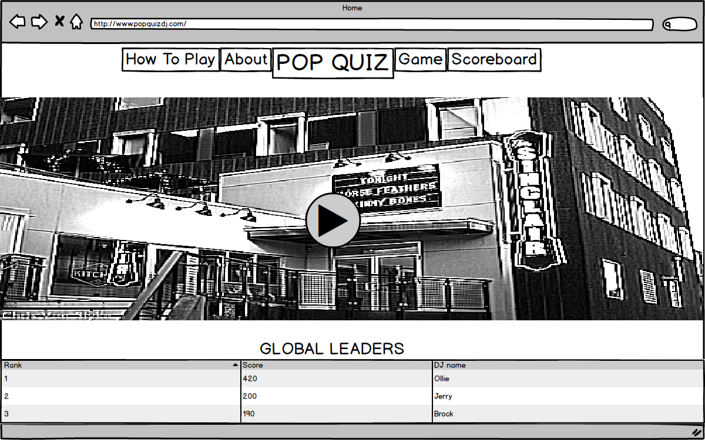
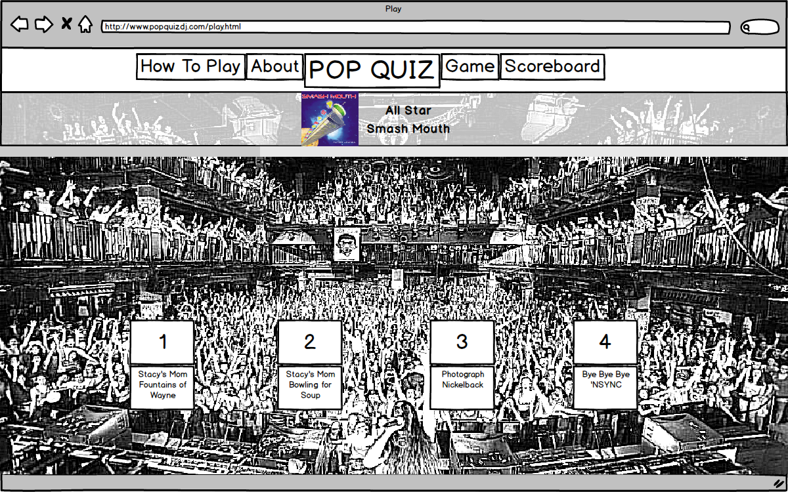
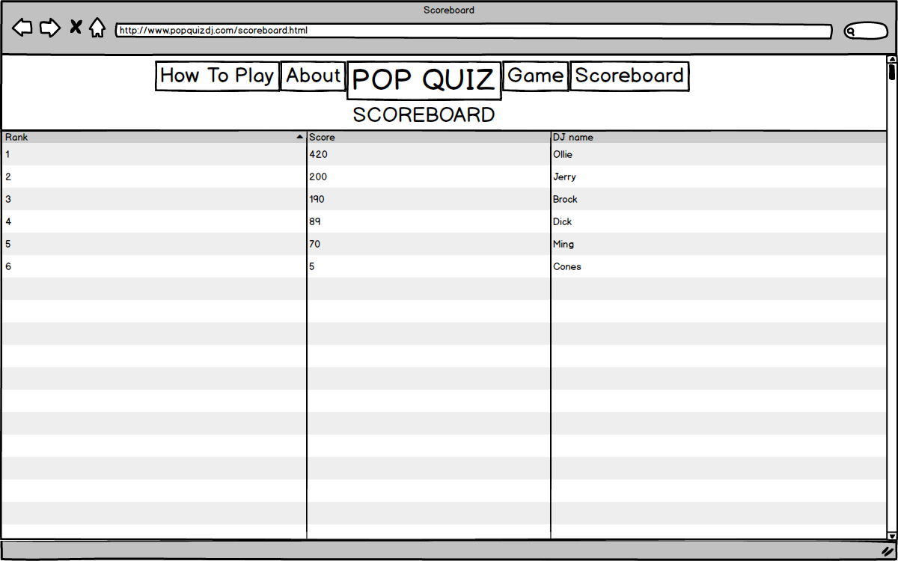

# Mix Master

### Problem Statement
People don't know how to choose the next song in a playlist.

### How do you solve the problem?
Have an interactive game that gives people more points for choosing songs that are similar to each other in a sequence.

### List of all the features that your team will implement
#### Features of the game
* have a total of like 100 songs, people can start with a choice of 10 and then feed them similar genre songs in the multiple-choice
* multiple-choice, you choose the next song - free spotify 30 second snippets
* get points for choosing songs that are related (spotify API - danceability, excitement, tempo)
* show different crowd responses with gifs for good, okay and poor choices
* can have transitions between genres - ex: Uma Thurman by Fall Out Boy is Pop/Rock/Electronic so multiple choice would include songs of all those genres

#### Features - Pick 3
* Front-end framework - use React for both mobile and desktop
* Server-side persistance - hold high scores (firebase)
* Geolocation to show the closest venues you could be playing at and show a picture? or client-side persistance for high scores

### Data used/collected
* Scores from users in the game
* Song data from Spotify (tempo, different attributes, 30-second preview)

### Any algorithms or special techniques
* Calculating scores for each choice of next song

### Wireframes
#### Homepage

#### Play Setup page

#### Play page

#### Scoreboard

## End of project writeup

### Implementation
* Front End - We used several different web development technologies on the front end including using Bootstrap as a framework.
* Back End - We used the Spotify API to get information on songs, as well as 30 second previews of the songs that allow the user to play well known sections of songs and will help them make more informed choices. We used a MongoDB database to store their scores and used HTTP requests to retrieve their scores and populate our global leader score board. We also used a location finder using the Google Maps API to show pictures of popular concert venues on the homepage. 

#### What We Learned & Tradeoffs Encountered
* There were several lessons that we learned while making this project. There were times when we ran into challenges that were causing a lot of frustration within the group, and we soon learned that by putting that issue to the side for a period of time, it often became much easier to solve the problem after coming back to it several hours later. We also quickly realized that dividing different parts of the project between the group members allowed us to make much more progress, much more quickly. We were planning on making several tradeoffs throughout the project, but we ended up making a product that accomplished every thing we wanted to and is something that we can all be proud of. We ended up not needing to make any significant tradeoffs.

#Comments by Ming
* My only gripe is the title --it doesn't reflect the premise of this fantastic idea.  I was thinking it would be another academic flash card game but I was wrong, very wrong.
